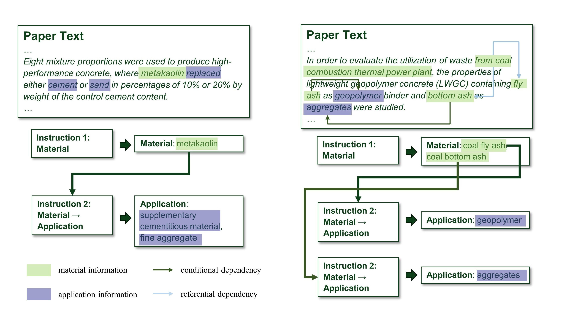
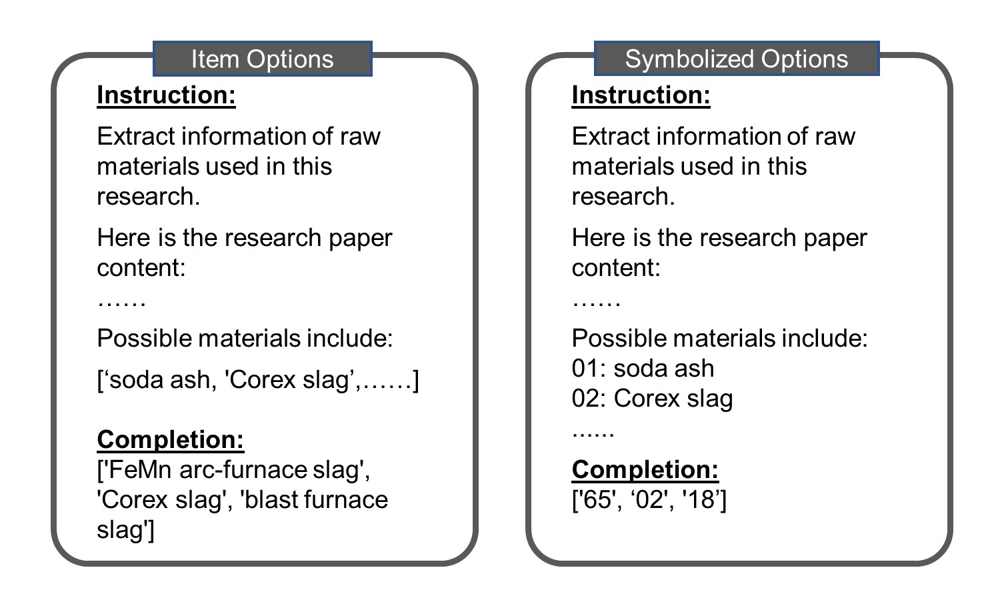
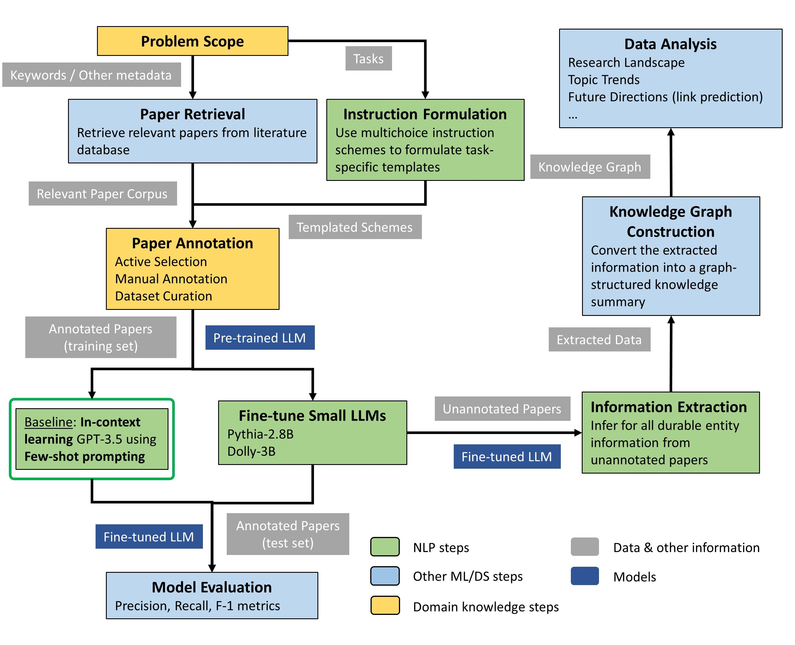
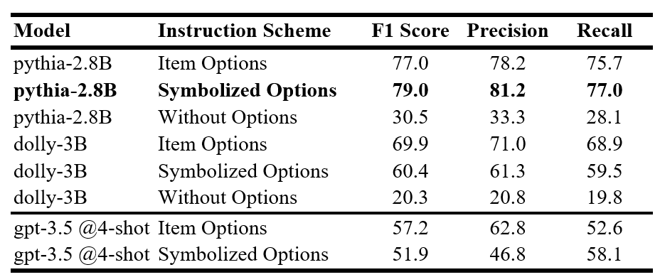
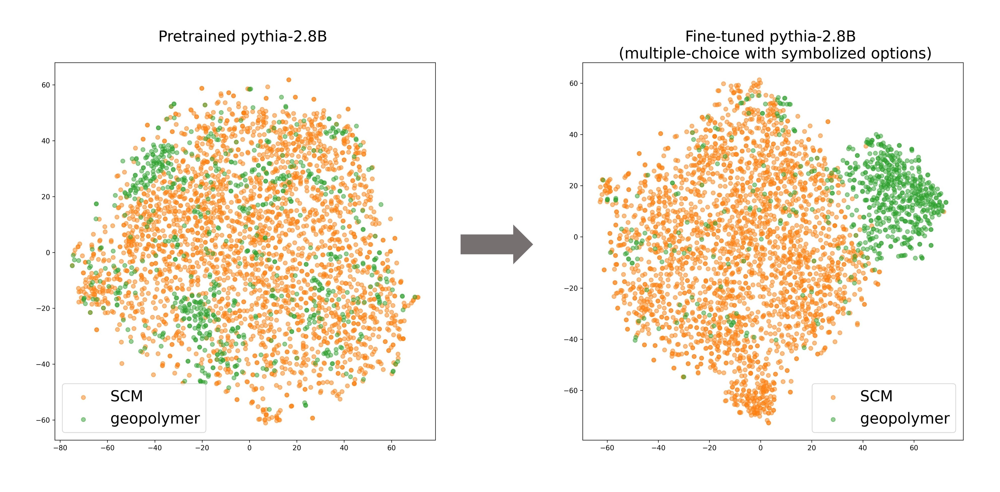
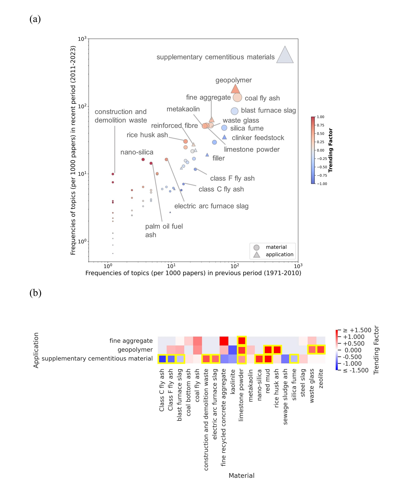
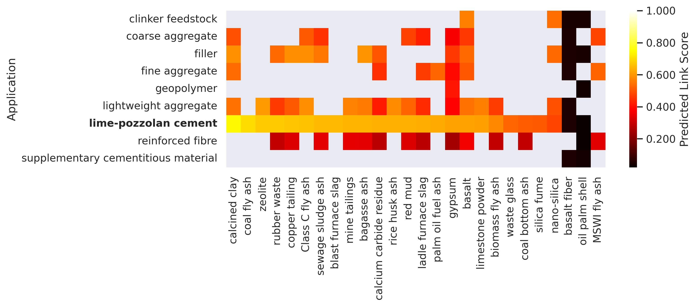

# Table of Contents
* [Introduction](#intro)
* [References](#refs)
* [Example](#example)
* [Code Usage](#code_usage)
* [Correspondence](#corres)

<a name="intro"></a>
Introduction - (Symbolized) Multichoice Instruction Tuning for LLM Literature Mining
--------------------------

This is the code base for a novel LLM-based framework for scientific literature mining and topic analysis.

Named-Entity Recognition (NER) and Relation Extraction (RE) are considered crucial first steps in automated literature mining, and their applications in a wide range of scientific research corpora have proven effective. However, not all scientific research domains can capitalize on such techniques, as the direct, noun-phrase-like source text required for NER and subsequent RE can be a luxury in certain fields. This is especially pronounced in the emerging sustainability research fields, where the academic communication often involves highly linguistically complex context characterized by non-Noun-Phrase source text, unstandardized terminology, non-local and non-sequential semantic or syntactic dependency, and non-injective entity relations.

Taking sustainable materials and specifically sustainable concrete (building material) for example, the aforementioned linguistic complexity can be exemplified as follows, posing significant challenges to direct information extraction:



Inspired by the multchoice problem-solving tasks in LLM studies, we reformulate the literature mining problem, and more specifically the named entity inference task, into a multichoice problem with provided instructions. This technique has 3 major advantages:

1) The model can theoretically learn to generate answers with arbitrarily many items (choices), addressing the non-injective mapping relations;
2) The provided instructions can offer valuable cues on the task, including the conditional relations (e.g. applications conditioned on a certain material);
3) The multichoice formulation can explicitly enumerate sensible choices of entities, addressing the problems of unstandardized terminology, non-Noun-Phrase source text, and non-local dependencies.

The formulation of instruction-completion pairs can be exemplified as follows (to be more comprehensive, we design 2 different schemes for choice notation and can therefore compare the resulting model performances):



## Workflow

In general, for any scientific literature mining tasks with the papers pocessing some of the aforementioned challenges for direct extraction of desirable named entity information, the workflow of our work can be generalized to address the challenges.




<a name="refs"></a> 
References
--------------------------
If you find either our methodology or the data product useful, please consider citing the following papers:

1) Literature Mining with Large Language Models to Assist the Development of Sustainable Building Materials. 
Yifei Duan, Yixi Tian, Soumya Ghosh, Richard Goodwin, Vineeth Venugopal, Jeremy Gregory, Jie Chen, Elsa Olivetti. ICLR Workshop Tackling Climate Change with Machine Learning, 2024. [paper](https://s3.us-east-1.amazonaws.com/climate-change-ai/papers/iclr2024/39/paper.pdf)
2) LLM-Empowered Literature Mining for Material Substitution Studies in Sustainable Concrete. Yifei Duan, Yixi Tian, Soumya Ghosh, Vineeth Venugopal, Jie Chen, Elsa Olivetti. [preprint](https://papers.ssrn.com/sol3/papers.cfm?abstract_id=5017239)


<a name="example"></a> 
Example
--------------------------

Here are some of the analytical results in the use case of sustainable building material development

**Model Performance**



It can be observed that our method leveraging multichoice instructions to fine-tune lightweight LLMs (2.8B) significantly outperforms the in-context few-shot learning baseline using GPT-3.5 (175B). Despite having undergone additional pre-training on instruction-following data, dolly performs worse than its pythia counterpart, highlighting the potential challenges for transferring instruction-following capability trained on general commonsense data to specialized scientific contexts.


**Text Embeddings**



Using the examples contrasting paragraphs discussing the applications of supplementary cementitious materials (SCMs) and geopolymers, 2 distinct mechanisms of alternative binder material substituion in concrete, we can observe the partition patterns become much clearer after fine-tuning with multichoice instructions.

**Knowledge Graph Analysis**



Temporal trends of research topics can be analyzed with literature-mined data. For example, in this use case, geopolymer and fine aggregate studies have surged in the recent period across a variety of raw materials, while clinker feedstock and filler studies have declined. Although supplementary cementitious materials (SCMs) have remained a research hotspot over time, a systematic shift was revealed in recent studies from commercially adopted industrial residues to natural minerals and other secondary materials.

Due to the declining supply of industrial residues that have been adopted in commercial concrete production, the identified potentials of alternative constituent substitution strategies can be valuable.



Through link prediction based on the knowledge graph, it can be noticed that among the underexplored research topics, lime-pozzolan cement stands out as a potentially promising future research direction across a wide range of materials.


<a name="code_usage"></a> 
Code Usage
--------------------------

1. Run the following command for Supervised Fine Tuning of a model (specified in a config file with other arguments)
``` 
python ./src/sft_plain.py --config_path ./configs/Full_SFT.yaml (or Task_SFT.yaml)
```

2. Run the following command for Low Rank Adapted (LoRA) Supervised Fine Tuning of a model (specified in a config file with other arguments)
```
python ./src/sft_lora.py --config_path ./configs/Full_SFT.yaml (or Task_SFT.yaml)
```

3. Run the following command for in-context few-shot learning using openai models
```
python ./src/few-shot-openai.py
```

4. Run the following command for generating completions using tuned model(s)
```
python ./src/completion/completion_gen.py --config_path ./configs/comp_gen/task_gen.yaml 
```

5. Run the following command for evaluating the generated completions
```
python ./src/completion/performance_eval.py --config_path ./configs/comp_gen/task_gen.yaml
```